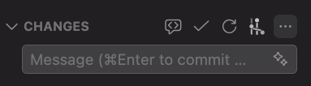

# Git VS Code

- `control + shift + e`: file explorer [custom]
- `control + shift + f`: search [custom]
- `control + shift + g`: open source control

## Symbols

- U: untracked
  - brand new file
  - needs a `git add`
- M: modified
  - an existing file that was already in your last commit
- A: added
  - it was untracked, now it's been staged
  - ready to be commited
- D: deleted
- C: conflict
  - merge conflict

## Menu with options

Hover over the 3 dots beside changes:

You'll have these options
