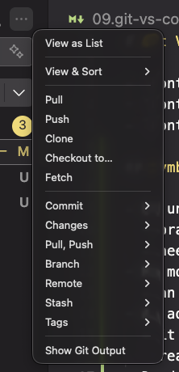
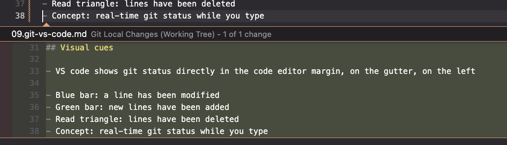

# Git VS Code

- `control + shift + e`: file explorer [custom]
- `control + shift + f`: search [custom]
- `control + shift + g`: open source control

## Symbols

- U: untracked
  - brand new file
  - needs a `git add`
- M: modified
  - an existing file that was already in your last commit
- A: added
  - it was untracked, now it's been staged
  - ready to be commited
- D: deleted
- C: conflict
  - merge conflict

## Menu with options

Hover over the 3 dots beside changes:

You'll have these options:

## Visual cues

- VS code shows git status directly in the code editor margin, on the gutter, on the left

- Blue bar: a line has been modified
- Green bar: new lines have been added
- Read triangle: lines have been deleted
- Concept: real-time git status while you type

